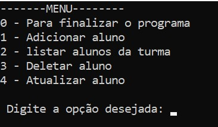
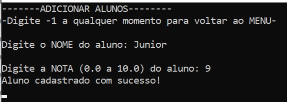
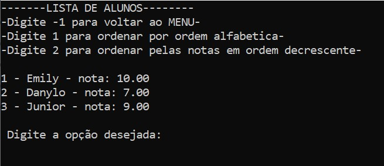
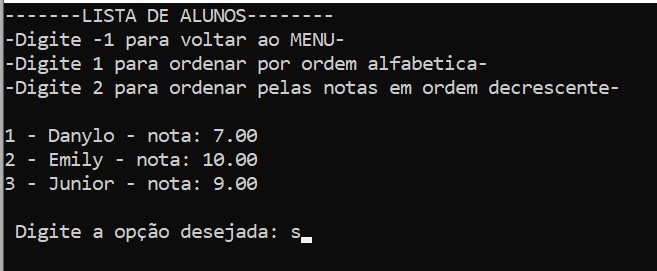
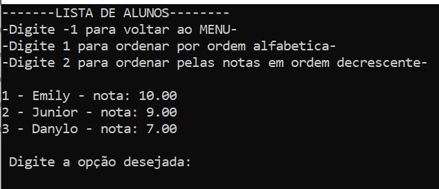
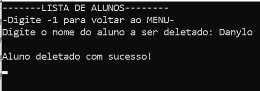

# Gerenciador de Alunos

Este programa em Go foi desenvolvido para gerenciar uma lista de alunos e suas respectivas notas, permitindo a execução de operações como adicionar, listar, atualizar e deletar alunos. Abaixo estão os principais conceitos abordados e as funcionalidades implementadas.



## **Conceitos Abordados**

- **Ponteiros e Referências**

1. O uso de ponteiros é central no programa, principalmente ao manipular a lista de alunos.

2. Funções como adicionarAluno e deletarAluno recebem um ponteiro para a lista de alunos ([]Aluno), permitindo que as alterações feitas dentro dessas funções sejam refletidas diretamente na lista original, sem a necessidade de criar cópias da estrutura.

3. Da mesma forma, o controle do tamanho da lista é feito por meio de um ponteiro para o tamanho (*int), garantindo que qualquer modificação no tamanho da lista seja aplicada no contexto global do programa.

- **Algoritmo de Ordenação**

1. O programa implementa o algoritmo de ordenação Insertion Sort para ordenar a lista de alunos, tanto por nome quanto por nota.

2. O Insertion Sort é um algoritmo simples e eficiente para listas pequenas, que trabalha inserindo elementos na posição correta dentro de uma parte já ordenada da lista. Ele é utilizado aqui para ordenar os alunos conforme a escolha do usuário.

3. Para evitar modificar a lista original, utilizamos uma cópia da lista durante o processo de ordenação, mantendo a estrutura original intacta e permitindo que o usuário alterne entre diferentes critérios de ordenação sem impactar os dados originais.

- **Funções Recursivas**

1. Algumas funções, como a de adicionar alunos, fazem uso de chamadas recursivas para repetir a execução de uma tarefa (no caso, de adicionar alunos até que o usuário decida sair). Isso facilita a navegação pelo programa sem a necessidade de criar loops complexos

## Funcionalidades Principais

- **Adicionar Aluno**: O programa solicita ao usuário o nome e a nota do aluno. Os dados são validados para garantir que a nota esteja no intervalo de 0 a 10. A lista de alunos é atualizada com o novo aluno, e o tamanho da lista é ajustado.



- **Listar Alunos**: A lista de alunos pode ser visualizada, e o usuário tem a opção de ordenar os alunos por nome (ordem alfabética) ou por nota (ordem decrescente).

Ordem padrão


Ordenada por nome


Ordenada por nota decrescente


- **Atualizar Aluno**: O usuário pode buscar um aluno pela nome e atualizar seus dados (nome ou nota).


- **Deletar Aluno**: O usuário pode remover um aluno da lista, buscando-o pelo nome. A lista é atualizada e o tamanho é ajustado.


## Como Executar

1. **Pré-requisito**: Ter o Go instalado na máquina

2. **Passo a passo**

- Clonar o repositório

```bash
git clone https://github.com/DanyloHenrique/sistemaDeNotasComGo.git
```

- Encontrar a pasta do projeto

```bash
cd sistemaDeNotasComGo
```

- Executar o programa

```bash
go run main.go
```

- (Opcional) gerar o executável

```bash
go build main.go
```
